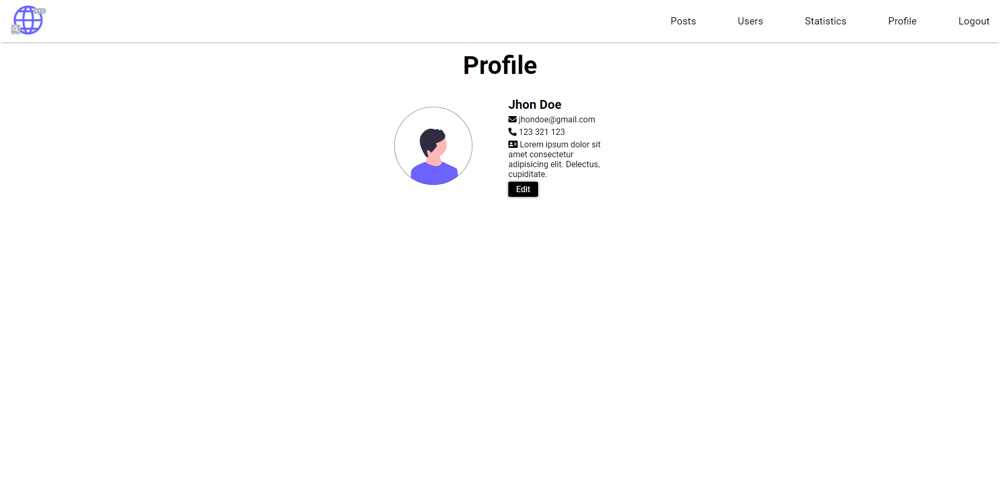

# FRONTEND BLOG

Blog skierowany dla osób interesujących się szeroko pojętym frontendem, które chcą rozwijać swoje umiejętności w tym kieunku.
Posty to nie tylko zwykłe poradniki, ale też artykuły o nowościach panujących na frontendzie.

## Strona powitalna

-   nawigacja
-   header z grafiką i tytułem storny
-   przycisk do przejścia na dół strony

## Sekcja z artykułami

-   nawigacja
-   najnowsze artykuły wraz z grafiką
-   przycisk do rozwinięcia tesktu

## Sekcja subscribe

-   nawigacja
-   tabela z rozpiską co daje subskrybcja bloga
-   przycisk do zapisania się do subskrybcji

## Stopka

-   formularz kontaktowy
-   podstawowe informace o stronie
-   link do strony informacyjnej
-   link do CMS

## Strona informacyjna

-   nawigacja
-   informacje o stronie
-   link do pobrania specyfikacji
-   link do repozytorium na githubie

## Ekran logowania

-   formularz przekierowujący do CMSa

## Dashboard

### Statystyki

-   strona ze statystykami serwisu

### Posty

-   strona z postami serwisu, z możliwością przejscia do edycji wybranego postu

### Edycja postu

-   formularz do edycji postu

### Użtykownicy

-   strona z użytkownikami serwisu, z możliwościa przejścia do edycji użytkownika

### Edycja użytkownika

-   formularz do edycji użytkownika

### Profil zalogowanego użytkownika

-   podstawowe informacje o zalogowanym użytkowniku
-   przycisk do edycji zalogowanego użytkownika

